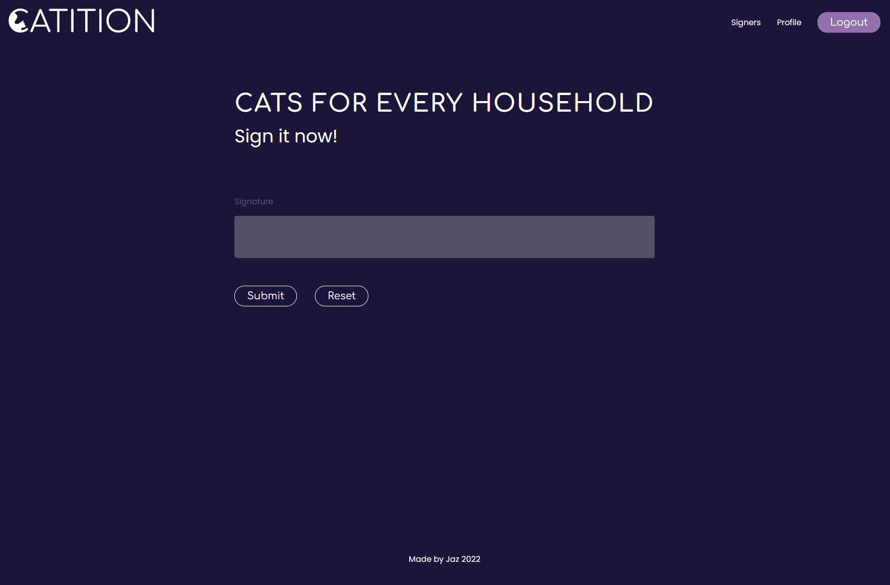

# catition - everybody deserves a cat

_project done during the SPICED academy Full Stack Web Development bootcamp_

## Tools & Technologies

-   handlebars
-   Node.js/ Express.js
-   PostgreSQL
-   Javascript
-   CSS

## Overview

-   Registration and Login page with error display
-   Bcrypt for password protection
-   Form for additional (optional) information
-   Signature visible in real time
-   Redo signature if needed
-   Signature can be deleted
-   List of fellow supporters available with their location
-   Personal information can be updated
-   Password can be changed (checked if the entries are equal)
-   Profile with all information's can be deleted

Note: This page can be viewed mobile, but it's not possible to set a proper signature

### Registration with information

<kbd></kbd>

### Optional Infos

<kbd></kbd>

### Signature

<kbd></kbd>

### Signers

<kbd></kbd>

### Settings

<kbd></kbd>

### More

-   Logo created by me
-   Illustrations by me and Draw.io
